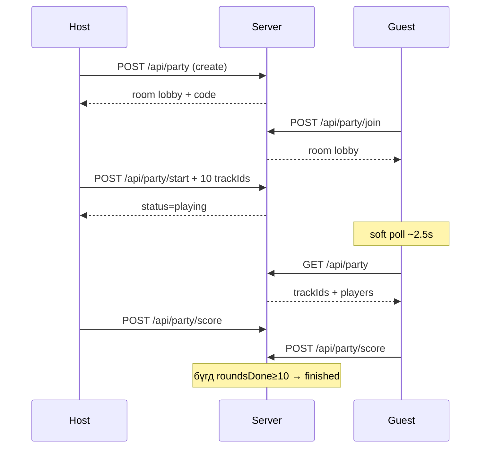

# Дуугаа Таа — Кодын бүрэн тайлбар

Энэ файл төслийн бүх гол файлуудын зорилго, урсгал, холбоосыг тайлбарлана.

**Live:** https://duu-taaya.vercel.app/  
**Стек:** Next.js 16 · React 19 · TypeScript · Tailwind CSS · Prisma · PostgreSQL (Neon) · Clerk

---

## 1. Төслийн бүтэц

```
duu-taaya/
├── app/
│   ├── page.tsx                      # Нүүр → SongGame
│   ├── layout.tsx                    # Root layout, фонт, Clerk, metadata
│   ├── globals.css                   # Бүх UI стиль (+ Game Mode)
│   ├── sign-in/[[...sign-in]]/       # Clerk нэвтрэх
│   ├── sign-up/[[...sign-up]]/       # Clerk бүртгэл
│   └── api/
│       ├── comments/route.ts         # Сэтгэгдэл
│       ├── leaderboard/route.ts      # Leaderboard
│       ├── listen-links/route.ts     # Spotify/YouTube шууд линк
│       ├── challenge/                # Хуучин Challenge API (одоо UI ашиглахгүй)
│       └── party/
│           ├── route.ts              # GET room / POST create
│           ├── join/route.ts         # Room-д орох / reconnect
│           ├── start/route.ts        # Host эхлүүлэх + trackIds
│           └── score/route.ts        # Оноо / streak / roundsDone
├── components/
│   ├── song-game.tsx                 # Үндсэн тоглоом (solo + party)
│   ├── game-mode-panel.tsx           # Хамт тоглох UI (Party/1v1/Streak/Hot Seat)
│   ├── app-clerk-provider.tsx        # Clerk wrapper
│   └── clerk-identity-bridge.tsx     # Clerk нэр → тоглогчийн нэр
├── data/
│   └── catalog.ts                    # Дууны сан, жанр, anime map
├── lib/
│   ├── prisma.ts                     # Prisma client + Neon retry
│   └── party.ts                      # Party төрөл, serialize, код үүсгэх
├── prisma/
│   └── schema.prisma                 # DB schema
├── generated/prisma/                 # Prisma client (gitignore)
├── public/
├── .env                              # DATABASE_URL, Clerk keys (commit хийхгүй)
├── CODE.md                           # Энэ файл
└── README.md
```

---

## 2. App слой

### `app/page.tsx`
- Зөвхөн `<SongGame />` render хийнэ.
- Бүх тоглоом нэг client component дээр төвлөрсөн.

### `app/layout.tsx`
- HTML `lang="mn"`.
- Фонт: **Unbounded** (гарчиг) + **Manrope** (бичвэр).
- Clerk provider + identity bridge холбогдсон.
- Metadata: гарчиг, тайлбар, favicon.

### `app/globals.css`
- CSS хувьсагч: `--bg`, `--accent` (#ff2f55), `--good` гэх мэт.
- Layout: `.shell` (sidebar + stage), `.rail`, `.hud`.
- Тоглоом: wave visualizer, answer box, reveal overlay, fireworks.
- Leaderboard / name modal: `.board-overlay`, `.board-card`.
- FAB: `.fab-dock`, `.settings-pop`, `.comments-pop`.
- **Game Mode:** `.game-mode-card`, `.gm-grid`, `.gm-tile`, `.gm-code`, `.gm-status`, `.gm-dot`, `.gm-auth-gate`, `.gm-winner` гэх мэт.

### Auth хуудсууд
- `app/sign-in/[[...sign-in]]/page.tsx` — Clerk SignIn
- `app/sign-up/[[...sign-up]]/page.tsx` — Clerk SignUp
- Game Mode нээхэд нэвтрээгүй бол modal-аар SignIn шаарддаг.

---

## 3. Дата каталог — `data/catalog.ts`

| Export | Утга |
|--------|------|
| `Genre` | `all`, `new`, `hiphop`, `pop`, `rock`, `traditional`, `anime`, `jpop`, `nineties`, `twoThousands` |
| `Mode` | `mongolian` \| `foreign` |
| `Difficulty` | `easy` \| `medium` \| `hard` \| `expert` |
| `mongolianPools` / `foreignPools` | iTunes **artist ID** (жанраар) |
| `mongolianFeatured` / `foreignFeatured` | Тодорхой **track ID**-ууд |
| `animeSources` | trackId → anime нэр |
| `animeSourcesByTitle` | canonical title → anime |
| `animeRomajiByCanon` | Зөвшөөрөгдөх romaji |
| `animeRomajiDisplay` | Харуулах romaji |
| `cuePoints` | Зарим дууны preview эхлэх секунд |
| `difficultyLimits` | Түвшин бүрийн сонсох хугацаа (секунд) |
| `labels` | Жанрын UI нэр |

**Ачаалал:** iTunes Lookup / Search API-аар artist/track ID-аас `previewUrl` авна. Preview байхгүй дууг алгасна.

---

## 4. Үндсэн тоглоом — `components/song-game.tsx`

`"use client"` — solo + multiplayer бүх интерактив логик энд (~2700 мөр).

### 4.1 Туслах функцууд

| Функц | Зорилго |
|-------|---------|
| `norm` | Текст цэвэрлэх |
| `canonicalTitle` | Remaster/live/remix хасах |
| `distance` | Levenshtein зай |
| `titleHits` / `romajiHits` | Хариулт зөв эсэх |
| `guessCorrect` | ID / ижил дуу / title / romaji |
| `animeOf` / `romajiOf` | Anime нэр, romaji |
| `resolveListenLinks` | `/api/listen-links` |
| `shuffle` / `seededShuffle` | Холих |
| `pickSetIds` | Party-д 10 trackId сонгох |
| `mergeBoards` | Local + server leaderboard |

### 4.2 Solo урсгал

```
bootReady
  → load() → iTunes-ээс дуу татах
  → takeNext() → нэг дуу
  → play() → preview (difficulty-ийн секунд)
  → submit() / Skip
  → reveal() → зөв/буруу + SFX + (зөв бол fireworks)
  → Spotify/YouTube линк
  → 10 дууны дараа leaderboard илгээх
```

### 4.3 Гол state

| State | Утга |
|-------|------|
| `mode`, `genre`, `difficulty` | Горим / жанр / түвшин |
| `tracks`, `current` | Дууны жагсаалт, одоогийн |
| `score`, `streak`, `round` | Оноо, цуврал, 1–10 |
| `guess`, `selected` | Хариулт |
| `lockedTrackIds` | Party-ийн нийтлэг 10 дуу (null = solo) |
| `party` | Одоогийн PartyRoomInfo |
| `hotSeatNames` / `hotSeatScores` / `hotSeatTurn` | Local Hot Seat |
| `gameModeOpen` | Game Mode panel |
| `playerName`, `board`, `comments` | Нэр, leaderboard, сэтгэгдэл |

### 4.4 Чухал refs

| Ref | Зорилго |
|-----|---------|
| `partyCodeRef` | Poll / score-д ашиглах код |
| `partyAppliedRef` | Progress нэг удаа л сэргээх (soft poll reset-ээс хамгаална) |
| `partyResumeRef` | `loadByTrackIds`-д хэд дэх дуунаас үргэлжлэх |
| `partyJoinAttemptRef` | Join давхардуулахгүй |
| `scoreRef` / `streakRef` / `nameRef` | Async timeout дотор шинэ утга |

### 4.5 Party функцууд

| Функц | Юу хийдэг |
|-------|-----------|
| `applyParty(info, { soft? })` | Room state шинэчлэх. Soft = зөвхөн оноо/статус (mode/URL/resume биш). Гишүүнд л track lock. Анхны lock үед score/round сэргээнэ. |
| `createParty(kind)` | `POST /api/party` |
| `joinParty(code)` | `POST /api/party/join` — mid-game reconnect зөвшөөрнө |
| `startParty()` | Host `pickSetIds` → `POST /api/party/start` |
| `submitPartyScore` | Оноо + streak + roundsDone |
| `refreshParty` | ~2.5с тутам soft poll |
| `leaveParty` | Local state + URL `?p=` цэвэрлэх |
| `loadByTrackIds` | Party-ийн ижил 10 дууг iTunes-ээс ачаалах + resume |
| `setupHotSeat` / `exitHotSeat` | Нэг төхөөрөмж дээр ээлжлэн |

### 4.6 Boot / reconnect

1. URL-д `?p=CODE` (эсвэл хуучин `?c=`) байвал room GET хийнэ.
2. Lobby / playing / finished — Game Mode panel нээгдэнэ, мессеж өгнө.
3. Clerk нэвтэрсний дараа (`partyAuthed`) автомат `joinParty` эсвэл аль хэдийн гишүүн бол `applyParty` дахин (track lock + resume).
4. Soft poll хэзээ ч score/round-ыг 0 болгохгүй.

### 4.7 Reveal + party төгсгөл

- Дуу бүрийн дараа `submitPartyScore(score, streak, roundsDone)`.
- `round >= 10` (party): panel нээнэ, **дахин load хийхгүй** (solo шиг дараагийн set эхлэхгүй).
- Бүх тоглогч `roundsDone >= 10` бол сервер room-ыг `finished` болгоно.

### 4.8 Аудио / UI

- `<audio>` + Web Audio visualizer
- `playSfx("good"|"bad")`, `cuePoints`
- Зүүн rail, HUD, stage, reveal overlay, FAB
- «Хамт тоглох» → `GameModePanel`

### 4.9 LocalStorage

| Түлхүүр | Утга |
|---------|------|
| `duuTaayaName` | Тоглогчийн нэр |
| `duuTaayaGuest` | Зочин нэр |
| `duuTaayaSfxVol` | SFX чанга |
| `duuTaayaBoard` | Local leaderboard |
| `duuTaayaRecent` | Саяхан тоглосон trackId |

---

## 5. Game Mode UI — `components/game-mode-panel.tsx`

| Mode | Төрөл | Max | Тайлбар |
|------|-------|-----|---------|
| **Party** | Online | 8 | Ижил 10 дуу, live оноо |
| **1v1 (duel)** | Online | 2 | Хоёр хүн — Эхлэхэд 2 хүн шаардлагатай |
| **Streak** | Online | 6 | Shared streak харуулна |
| **Hot Seat** | Local | 6 | Нэг утас, ээлжлэн — оноо клиент дээр |

**Auth gate:** Clerk асаалттай бол нэвтрээгүй хэрэглэгч SignIn харна.

**Room view:** код, статус (lobby/playing/finished), тоглогчийн жагсаалт (roundsDone/10, streak, score), ялагч (finished), Link хуулах, Эхлэх / Тоглох / Гарах.

---

## 6. Party lib — `lib/party.ts`

| Export | Зорилго |
|--------|---------|
| `PARTY_KINDS` | `party` \| `duel` \| `streak` |
| `PARTY_MAX` | Төрөл бүрийн maxPlayers |
| `PartyRoomInfo` / `PartyPlayerInfo` | Клиент төрлүүд |
| `cleanPartyName` | Нэр цэвэрлэх (max 16) |
| `makePartyCode` | 6 оронтой код (ambiguous үсэггүй) |
| `serializeParty` | Prisma row → JSON (тоглогчдыг score-оор эрэмбэлнэ) |

---

## 7. API

### Leaderboard — `GET/POST /api/leaderboard`
- GET: Top 50 (score ↓, streak ↓)
- POST: `{ name, score, streak, mode, difficulty }`
- Ижил `nameKey` дээр зөвхөн илүү өндөр оноо

### Comments — `GET/POST /api/comments`
- GET: Сүүлийн ~80
- POST: `{ name, body }`

### Listen links — `GET /api/listen-links?title=&artist=`
- YouTube + Spotify хайлт → шууд URL (cache ~6 цаг)

### Party

| Endpoint | Method | Юу хийдэг |
|----------|--------|-----------|
| `/api/party` | GET `?code=` | Room мэдээлэл |
| `/api/party` | POST | Room үүсгэх + host тоглогч |
| `/api/party/join` | POST | Lobby-д шинэ тоглогч **эсвэл** mid-game reconnect (existing name) |
| `/api/party/start` | POST | Host л эхлүүлнэ; `trackIds` яг 10 |
| `/api/party/score` | POST | `score` = max(old, new); `streak` = абсолют (буурч болно); `roundsDone` = max; бүгд 10 бол `finished` |

### Challenge (хуучин)
- `app/api/challenge/*` + Prisma `Challenge` / `ChallengeResult` үлдсэн.
- UI одоо Game Mode (Party) ашиглана — Challenge солигдсон.

---

## 8. Database — Prisma

### Models

```
LeaderboardScore  — нэр, оноо, difficulty тус бүрийн оноо
Comment           — сэтгэгдэл
Challenge         — хуучин invite challenge
ChallengeResult   — challenge үр дүн
PartyRoom         — код, kind, status, trackIds[], host, maxPlayers, expiresAt
PartyPlayer       — nameKey, score, streak, roundsDone, ready
```

### `lib/prisma.ts`
- Singleton `PrismaClient` → `generated/prisma`
- `db(fn)` — Neon idle / stale client үед reconnect + retry
- Hot-reload-д `partyRoom` байхгүй хуучин client-ийг дахин үүсгэнэ

### Команд

```bash
npm run db:generate
npm run db:push
npm run db:studio
```

`.env` жишээ:

```
DATABASE_URL="postgresql://...?sslmode=require"
NEXT_PUBLIC_CLERK_PUBLISHABLE_KEY=...
CLERK_SECRET_KEY=...
```

---

## 9. Party урсгал (диаграм)



```mermaid
flowchart TD
  A[Хэрэглэгч] --> B[SongGame]
  B --> C[iTunes Lookup]
  B -->|таах| D[reveal]
  D --> E[/api/listen-links]
  B -->|10 дуу| F[/api/leaderboard]
  B -->|сэтгэгдэл| G[/api/comments]
  B -->|Хамт тоглох| H[GameModePanel]
  H -->|Clerk| I[Нэвтрэх]
  H --> J[/api/party*]
  J --> K[(PostgreSQL Neon)]
  F --> K
  G --> K
```

---

## 10. Онцлог функцууд

| Онцлог | Хэрхэн |
|--------|--------|
| Монгол / Гадаад | Өөр pool + iTunes country |
| Anime OP | Curated track + romaji/alias |
| 90s / 2000s | Artist pool + `releaseDate` шүүлт |
| Зөв хариулт | fuzzy title + romaji + suggestion ID |
| Fireworks | Зөв таахад CSS particle |
| Leaderboard | PostgreSQL + localStorage merge |
| Game Mode | Party / 1v1 / Streak / Hot Seat |
| Party resume | Refresh хийсэн ч roundsDone-оос үргэлжилнэ |
| Soft poll | Оноо reset хийхгүй, зөвхөн live board |
| Auth | Clerk — Game Mode-д шаардлагатай |

---

## 11. Ажиллуулах

```bash
npm install
cp .env.example .env   # DATABASE_URL + Clerk keys
npm run db:push
npm run dev            # http://localhost:3000
```

Vercel: `DATABASE_URL`, Clerk key-үүд → deploy.

---

## 12. Файлуудын үүрэг (нэг мөрөөр)

| Файл | Юу хийдэг |
|------|-----------|
| `app/page.tsx` | Нүүр → SongGame |
| `app/layout.tsx` | Layout, фонт, SEO, Clerk |
| `app/globals.css` | Бүх стиль + Game Mode |
| `components/song-game.tsx` | Solo + party тоглоом, audio, FAB |
| `components/game-mode-panel.tsx` | Хамт тоглох UI |
| `components/app-clerk-provider.tsx` | Clerk provider |
| `components/clerk-identity-bridge.tsx` | Clerk нэр sync |
| `data/catalog.ts` | Дууны ID сан, anime map |
| `lib/prisma.ts` | DB холболт + retry |
| `lib/party.ts` | Party төрөл / serialize |
| `prisma/schema.prisma` | Хүснэгтүүд |
| `app/api/leaderboard/route.ts` | Онооны API |
| `app/api/comments/route.ts` | Сэтгэгдлийн API |
| `app/api/listen-links/route.ts` | Listen URL |
| `app/api/party/route.ts` | Create / get room |
| `app/api/party/join/route.ts` | Join + reconnect |
| `app/api/party/start/route.ts` | Host start |
| `app/api/party/score/route.ts` | Live оноо |
| `app/api/challenge/*` | Хуучин challenge (legacy) |
